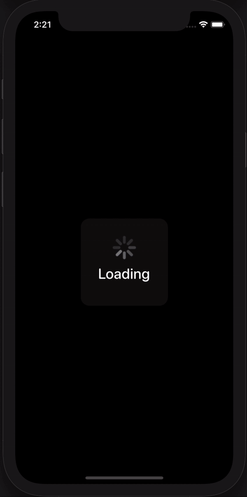

# Screenshot

	

# Crypto Portfolio Tracker
The app helps Crypto lovers to keep update with the market prices in real time and conveniently track their portfolio. This app was written in Swift, and SwiftUI for UI part. From this project, I expanded my knowledge about multithreading, reactive programming with Apple's Combine framework. Meanwhile, I applied and gained more understanding about MVVM architecture.

# Things I learned from this project
- Fetch data from RESTful API in multithreading manner, process the result data into consumable data using Combine framework
- Keep data in various places in sync by using Combine (i.e. CombineLatest)
- Sperate Networking layer from ViewModels layer to make the app scalable and easier to manage
- Cache image data using FileManager to improve app performance
- Keep portfolio data persistence using CoreData
- Draw a clean, beautiful line chart using Path

# Technology Used
- Swift
- SwiftUI
- Xcode
- Combine
- CoreData
